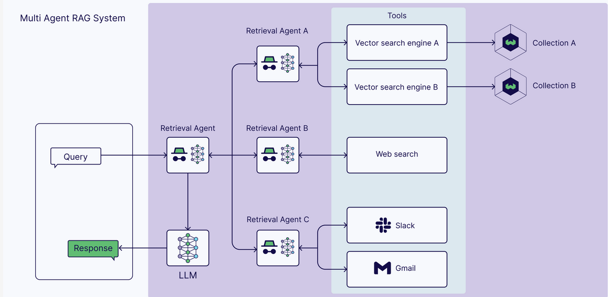

# Agentic RAG Project

This project demonstrates **Agentic Retrieval-Augmented Generation (RAG)** for Large Language Models (LLMs). Traditional “basic RAG” uses a single retrieval step from a vector store to inject external knowledge into an LLM’s prompt. **Agentic RAG** goes further: it equips the LLM with “tools” it can call repeatedly to refine retrieval, navigate documentation, and reason about how to get the most relevant data from your knowledge base.

In this setup, we:
- Scrape or crawl documentation pages from **Pydantic AI** and **LangChain** using [Crawl4AI](https://github.com/lancedikson/crawl4ai).
- Store the resulting text chunks, metadata, and embeddings in **Supabase** (acting as both a relational store and vector store).
- Build an **Agent** (using [Pydantic AI](https://github.com/camenduru/pydantic-ai)) that can:
  1. Perform **basic RAG** – retrieving relevant text from embeddings,
  2. List all available docs pages for each source,
  3. Retrieve entire pages’ contents if needed,
  4. Decide in real time **which source** (Pydantic AI docs or LangChain docs) to query based on the user’s request,
  5. Combine everything into a more flexible, iterative approach, i.e., “Agentic RAG.”
- Provide an interactive **Streamlit** UI to test queries and see the agent in action.

---

## Table of Contents

1. [Features](#features)
2. [Architecture Overview](#architecture-overview)
3. [Setup & Installation](#setup--installation)
4. [Supabase Database Schema](#supabase-database-schema)
5. [Data Ingestion (Crawling & Chunking)](#data-ingestion-crawling--chunking)
6. [Building the Agent (Basic vs. Agentic RAG)](#building-the-agent-basic-vs-agentic-rag)
7. [Streamlit UI](#streamlit-ui)
8. [Using Multiple Documentation Sources](#using-multiple-documentation-sources)
9. [Troubleshooting](#troubleshooting)
10. [Further Ideas & Extensions](#further-ideas--extensions)
11. [License](#license)

---

## Features

- **Parallel Web Crawling** using [Crawl4AI](https://github.com/lancedikson/crawl4ai) to scrape entire documentation sites quickly.
- **Chunking & Metadata**: Each page is split into smaller chunks with metadata (e.g., source, URL path, timestamps).
- **Embeddings**: Leverages OpenAI embeddings to create vector representations (`vector(1536)`) for each chunk, stored in Supabase.
- **Basic RAG Tool**: One-shot retrieval of the top-N relevant chunks for any user query.
- **Agentic RAG Tools**:
  - Listing all docs pages (by URL),
  - Fetching entire pages on-demand (so the agent can read long sections if needed),
  - Deciding whether to use Pydantic docs or LangChain docs,
  - Re-querying as needed to refine answers.
- **Streamlit UI**: A chat-like interface that streams the agent’s output and displays real-time tool calls and final answers.

---

## Architecture Overview

Below is a high-level depiction of how the pieces fit together. For more clarity on the overall “Agentic RAG” flow, see this diagram:



1. **Crawl & Chunk**  
   We use `crawl4ai` to fetch all pages from sitemaps (`Pydantic AI` or `LangChain`).  
   Each page is chunked into smaller text blocks, respecting paragraphs and code blocks.

2. **Store in Supabase**  
   Each chunk is stored in a `site_pages` table, containing:
   - URL, title, summary, content, embedding, metadata, etc.
   - A `source` field that distinguishes “pydantic_ai_docs” vs. “langgraph_docs” (or “langchain_docs”).

3. **Agent Tools**  
   - **Basic RAG**: Retrieve top matches by embedding similarity.  
   - **List Docs**: Return all distinct URLs from the `source` in question.  
   - **Fetch Page**: Return concatenated chunk text for a chosen URL.  

4. **Agent Execution**  
   - The agent (implemented with **Pydantic AI**) decides how to answer user questions:
     1. Possibly call “Basic RAG” for quick retrieval,
     2. Or list docs and fetch entire pages to get full code examples or detailed content.

5. **Streamlit UI**  
   A front-end that streams the conversation and the agent’s thought process (tool usage, chunk retrieval results) to the user.

---

## Setup & Installation

1. **Clone this repository**:

   ```bash
   git clone https://github.com/your-username/agentic-rag.git
   cd agentic-rag
